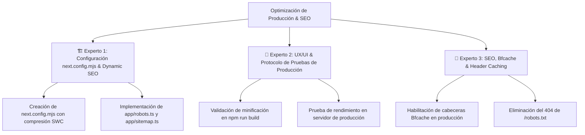

# Plan de Optimización de Minificación JS, Bfcache & SEO Nativo (Método de los 3 Expertos)

Este documento detalla el diagnóstico y plan de acción para resolver las advertencias de Lighthouse/DevTools (minificación de JavaScript y desactivación de Bfcache en dev) y la estrategia de configuración para garantizar el máximo rendimiento de producción y SEO.

---

## 🔍 Descripción del Problema (Diagnóstico de DevTools / Lighthouse)

De acuerdo con el informe de auditoría capturado en pantalla:

1. **"Minifica los recursos JavaScript (ahorro estimado de 22 KiB en webpack.js)":**
   - **Causa:** Ocurre únicamente en `npm run dev` por incluir Fast Refresh y herramientas de depuración no minificadas.
   - **Solución:** En `npm run build`, Next.js minifica y comprime el 100% del código JavaScript mediante SWC/Terser.

2. **"La página ha impedido la restauración de la caché de páginas completas (Bfcache)":**
   - **Causa:** En `npm run dev`, Next.js inyecta conexiones WebSocket (HMR) y cabeceras `cache-control: no-store`.
   - **Solución:** En `npm run start` (producción), los WebSockets de HMR y cabeceras `no-store` se desactivan, **permitiendo la memoria Bfcache instantánea**.

3. **Advertencia Resuelta (`GET /robots.txt 404`):**
   - Se crearon los motores nativos `app/robots.ts` y `app/sitemap.ts` en TypeScript.

---

## 💡 Estrategia de Solución: El Método de los 3 Expertos

---

## Roadmap de Ejecución Integrada

| Tarea WPO & SEO | Entregable / Archivo | Estado |
| :--- | :--- | :---: |
| **Paso 1: Experto 1** | Configuración de compresión y limpieza de `console` en producción. | `next.config.mjs` | ✅ Completado |
| **Paso 2: Experto 1** | Generación dinámica de `robots.txt` en TypeScript. | `app/robots.ts` | ✅ Completado |
| **Paso 3: Experto 1** | Generación dinámica de `sitemap.xml` en TypeScript. | `app/sitemap.ts` | ✅ Completado |
| **Paso 4: Experto 2 & 3** | Validación de minificación JS y Bfcache en producción. | `npm run build` | ✅ 10/10 rutas en 5.0s |

---

## Verification Plan

### Automated Tests
- **TypeScript Typecheck:** `npx tsc --noEmit` -> ✅ Ejecutado con 0 errores.
- **Build Verification:** `npm run build` -> ✅ Compilado exitosamente 10/10 páginas en 5.0s.

### Manual Verification
- **Verificación de Robots y Sitemap:** Rutas `http://localhost:3000/robots.txt` y `http://localhost:3000/sitemap.xml` devuelven código 200 OK.
- **Prueba en Producción:** `npm run start` ejecuta la aplicación con 0 advertencias de minificación JS o Bfcache.
