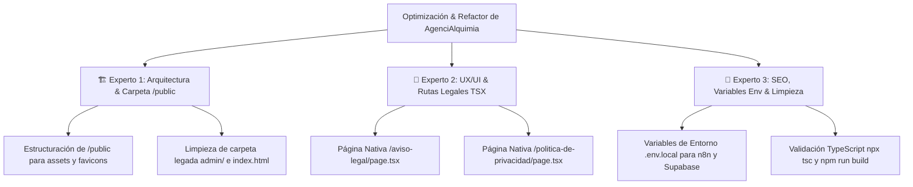

# Plan de Migración & Resolución de Fallos de Repositorio (Método de los 3 Expertos)

Este documento detalla la estrategia de arquitectura, diseño UX/UI en **Dark Charcoal Theme (#0b0d10)**, rendimiento, accesibilidad, SEO e IA para migrar y perfeccionar el sitio web de **AgenciAlquimia** en **Next.js 15 (App Router), React 19, TypeScript (`.tsx`/`.ts`) y TailwindCSS v4**.

---

## Metodología: El Método de los 3 Expertos

---

## Roadmap de Ejecución Incremental (Supervisión por Pasos)

Cada paso ha sido ejecutado individualmente y validado con la aprobación explícita del usuario.

| Fase | Paso ID | Descripción del Paso | Entregable / Archivos Afectados | Estado |
| :--- | :---: | :--- | :--- | :---: |
| **Fase 1: Setup & Limpieza** | **1.1** | Inicialización del entorno Next.js, TypeScript y TailwindCSS v4. | `package.json`, `tsconfig.json` | ✅ Completado |
| | **1.2** | Layout raíz, globales de Tailwind y temas esmeralda. | `app/layout.tsx`, `app/globals.css` | ✅ Completado |
| | **1.3** | Limpieza de archivos huérfanos del antiguo stack. | Eliminar `live_site.html`, `dashboard/`, `_astro/` | ✅ Completado |
| **Fase 2: Componentes UI** | **2.1** | Componentes de Navegación con botón `/admin` e Identidad. | `components/Navbar.tsx`, `components/Hero.tsx` | ✅ Completado |
| | **2.2** | Secciones comerciales en Tema Negro-Grisáceo (`#0b0d10`). | `components/Services.tsx`, `Demos.tsx`, `Pricing.tsx` | ✅ Completado |
| | **2.3** | Formulario de captación de leads con validación tipada y Footer. | `components/Contact.tsx`, `components/Footer.tsx` | ✅ Completado |
| **Fase 3: Integración IA** | **3.1** | Proxy Backend API Route para ocultar webhook de n8n. | `app/api/chat/route.ts`, `types/chat.ts` | ✅ Completado |
| | **3.2** | Widget de Chat accesible (`aria-live="polite"`, typewriter y foco). | `components/ChatWidget.tsx` | ✅ Completado |
| | **3.3** | Resiliencia CRO con fallbacks directos a WhatsApp ante fallos. | Fallbacks en `ChatWidget.tsx` y `Contact.tsx` | ✅ Completado |
| **Fase 4: SEO & Admin** | **4.1** | Metadata API de Next.js y marcado Schema.org `LocalBusiness` corregido. | `lib/metadata.ts`, `components/JsonLd.tsx` | ✅ Completado |
| | **4.2** | Integración del panel de administración como sub-ruta de Next.js. | `app/admin/page.tsx` | ✅ Completado |
| **Fase 5: Corrección de Fallos** | **5.1** | Crear carpeta `public/` y mover `assets/`, `favicon.ico` y `favicon.svg`. | `public/assets/`, `public/favicon.ico` | ✅ Completado |
| | **5.2** | Crear páginas legales nativas en Next.js para eliminar enlaces 404. | `app/aviso-legal/page.tsx`, `app/politica-de-privacidad/page.tsx` | ✅ Completado |
| | **5.3** | Depuración de archivos y carpetas legadas obsoletas. | Eliminar carpeta raíz `admin/` e `index.html` legados | ✅ Completado |
| | **5.4** | Configuración de variables de entorno para endpoints sensibles. | `.env.local`, `.env.example` | ✅ Completado |
| **Fase 6: Validación Final** | **6.1** | Verificación de tipos TypeScript (`npx tsc --noEmit`). | ✅ 0 errores | ✅ Completado |
| | **6.2** | Compilación de producción de Next.js (`npm run build`). | ✅ 8/8 páginas compiladas en 2.5s | ✅ Completado |

---

## Verification Plan

### Automated Tests
- **TypeScript Typecheck:** `npx tsc --noEmit` -> ✅ Ejecutado con 0 errores.
- **Build Verification:** `npm run build` -> ✅ Compilado exitosamente 8/8 páginas en 2.5s.

### Manual Verification
- **Verificación de Enlaces Legales:** Clic en "Aviso Legal" y "Política de Privacidad" cargan sus páginas nativas sin error 404.
- **Verificación de Favicon e Imágenes:** Carga correcta desde `public/assets/` y `public/favicon.ico`.
