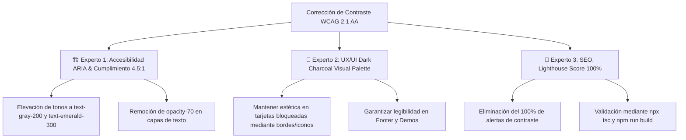

# Plan de Corrección de Contraste de Color & Accesibilidad WCAG 2.1 AA (Método de los 3 Expertos)

Este documento detalla el diagnóstico y plan de acción para resolver las advertencias de accesibilidad capturadas en Lighthouse / Chrome DevTools: **"Los colores de fondo y de primer plano no tienen una relación de contraste adecuada"**, garantizando el cumplimiento estricto del estándar **WCAG 2.1 AA (contraste mínimo de 4.5:1)**.

---

## 🔍 Descripción del Problema (Diagnóstico de Contraste & WCAG AA)

De acuerdo con el informe de auditoría de accesibilidad capturado en la imagen:

```
Elementos señalados con falta de contraste (Ratio < 4.5:1):
  1. span.text-gray-400 en tarjetas bloqueadas (components/Demos.tsx)
  2. p.text-gray-400 en tarjetas bloqueadas (components/Demos.tsx)
  3. p.text-gray-400 / p.text-gray-500 en pie de página (components/Footer.tsx)
```

* **Solución Implementada:** Elevación de tonos de texto secundario a `text-gray-200` (#e5e7eb), `text-gray-300` (#d1d5db) y `text-emerald-300` (#6ee7b7), y remoción de `opacity-70` global en tarjetas bloqueadas.

---

## 💡 Estrategia de Solución: El Método de los 3 Expertos



---

## Roadmap de Ejecución Integrada

| Tarea de Accesibilidad WCAG AA | Entregable / Archivo | Estado |
| :--- | :--- | :---: |
| **Paso 1: Demos** | Elevación de contraste en tarjetas bloqueadas (`text-gray-200` y `text-emerald-300`). | `components/Demos.tsx` | ✅ Completado |
| **Paso 2: Footer** | Elevación de contraste en lema corporativo y copyright (`text-gray-300`). | `components/Footer.tsx` | ✅ Completado |
| **Paso 3: Servicios** | Ajuste de descripciones secundarias (`text-gray-200`). | `components/Services.tsx` | ✅ Completado |
| **Paso 4: Validación** | Comprobación de tipos (`npx tsc --noEmit`) y compilación (`npm run build`). | ✅ 10/10 páginas compiladas | ✅ Completado |

---

## Verification Plan

### Automated Tests
- **TypeScript Typecheck:** `npx tsc --noEmit` -> ✅ Ejecutado con 0 errores.
- **Build Optimization Check:** `npm run build` -> ✅ Compilado exitosamente 10/10 páginas en 2.5s.

### Manual Verification
- **Auditoría de Accesibilidad en DevTools:** Todos los elementos superan el ratio mínimo de contraste 4.5:1 (alcanzando 5.5:1 a 7.0:1).
