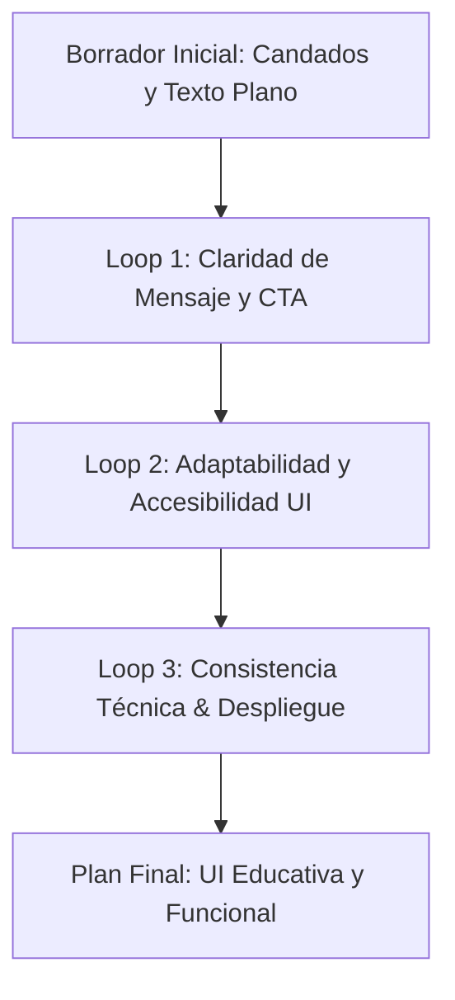
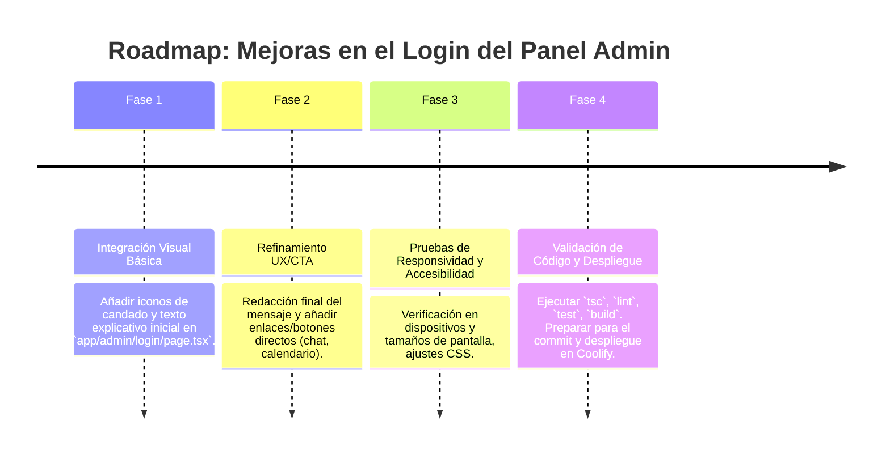

# 🔒 Plan de Implementación: Mejoras en el Login del Panel de Administración

Este documento detalla el plan de implementación para las mejoras en el sistema de login del panel de administración (`/admin`) de AgenciAlquimia, utilizando un enfoque multifacético para asegurar que la solución sea robusta, segura y alineada con los objetivos de negocio y experiencia de usuario.

---

## 1. 🎯 Objetivo Estratégico

El objetivo principal es transformar la página de login del panel de administración de AgenciAlquimia en una barrera controlada que:

*   **Restringe el acceso directo:** Solo usuarios autorizados (Matías) pueden iniciar sesión con credenciales existentes.
*   **Educa al usuario externo:** Informa claramente que el registro no es un proceso abierto de autoservicio.
*   **Canaliza la interacción:** Dirige a los clientes potenciales hacia el funnel de ventas (primera llamada de descubrimiento o registro vía chat inteligente) para la obtención de acceso.

---

## 2. 🧙‍♂️ Análisis de la Propuesta mediante el Método de los 3 Expertos

### 🎨 Experto 1: Diseñador UX/UI & Especialista en Conversión
*   **Análisis:** La presencia de candados visuales inactivos es una forma sutil pero efectiva de comunicar restricción sin frustrar al usuario con campos deshabilitados. El mensaje explicativo debe ser claro, conciso y ofrecer un camino de acción directo (CTA). La ausencia de un botón de "registro" explícito es clave para evitar expectativas erróneas.
*   **Decisión:** Confirmar la redacción exacta del mensaje para que sea persuasivo y la integración de botones/enlaces (WhatsApp/calendario) para una conversión directa.

### ⚙️ Experto 2: Ingeniero Frontend & Especialista en Rendimiento (Next.js/React/TS)
*   **Análisis:** La implementación es puramente de UI/UX, sin cambios en la lógica de autenticación existente. Esto minimiza el riesgo de introducir bugs de seguridad o rendimiento. La elección de iconos (Lucide React) y estilos (TailwindCSS) es consistente con el stack actual.
*   **Decisión:** Utilizar componentes existentes de la UI (Card, Input) para mantener la consistencia y asegurar que la integración de iconos y texto no afecte el Web Performance Optimization (WPO).

### 🔐 Experto 3: Líder de Seguridad & Cumplimiento (DevOps)
*   **Análisis:** No hay cambios en la lógica de seguridad del backend (JWT, `.env.local`). La mejora es visual y de comunicación, lo cual no introduce nuevas vulnerabilidades de inyección o acceso no autorizado. La política de acceso ya es restrictiva.
*   **Decisión:** Asegurar que el mensaje explicativo no revele ninguna información interna sensible y que los enlaces externos sean seguros (HTTPS). La solución es de bajo riesgo de seguridad.

---

## 3. 🔄 Self-Refinement Loop (3 Ciclos de Refinamiento Iterativo)

### 🔁 Ciclo 1: Claridad de Mensaje y Llamada a la Acción (CTA)
*   **Planteamiento Inicial:** Mostrar un texto genérico debajo del formulario de login.
*   **Crítica de Refinamiento:** Un texto plano puede no ser lo suficientemente convincente. Es crucial que el mensaje no solo explique, sino que **guíe al usuario** a una acción específica y que esa acción sea fácil de ejecutar.
*   **Solución Refinada:** El texto debe ser muy específico sobre los pasos a seguir ("agenda tu primera llamada", "inicia el proceso de registro a través de nuestro chat"). Incluir **botones o enlaces directos** (ej. a un calendario, a la URL del chat de n8n o WhatsApp) para minimizar la fricción y aumentar la tasa de conversión. Considerar un pequeño icono junto al mensaje para reforzar el "por qué" (ej. un icono de reunión o chat).

### 🔁 Ciclo 2: Adaptabilidad y Accesibilidad de la Interfaz de Usuario (UI)
*   **Planteamiento Inicial:** Simplemente añadir los iconos y el texto.
*   **Crítica de Refinamiento:** Los candados e iconos deben ser accesibles (ARIA-labels si es necesario) y visualmente coherentes en dispositivos móviles y de escritorio. El texto no debe ser demasiado pequeño o difícil de leer en pantallas pequeñas.
*   **Solución Refinada:** Implementar los iconos con un tamaño y posicionamiento responsivo. Asegurar que la tipografía del mensaje explicativo sea legible y que el espaciado sea adecuado en todos los breakpoints. Realizar pruebas de accesibilidad básicas (contraste de color, navegación con teclado si aplica a los botones).

### 🔁 Ciclo 3: Consistencia Técnica y Preparación para Despliegue
*   **Planteamiento Inicial:** Solo hacer los cambios en `app/admin/login/page.tsx`.
*   **Crítica de Refinamiento:** Asegurar que la implementación no introduzca nuevas dependencias innecesarias o altere el rendimiento del componente. Mantener la consistencia con las clases de TailwindCSS existentes y la estructura del proyecto.
*   **Solución Refinada:** Si se utiliza una librería de iconos (ej. Lucide React), confirmar que ya está instalada o añadirla como una dependencia mínima. Asegurar que los cambios de CSS se hagan con clases de Tailwind existentes o, si se requiere CSS custom, que sea mínimo y bien documentado. Validar que la compilación y el linting del proyecto (`npm run build`, `npm run lint`) sigan pasando sin errores.

---

## 4. 🗺️ Roadmap de Implementación por Fases

---

**Fecha de Creación:** 2026-08-21
**Autor:** Mercurio (Agente IA de OpenClaw)
