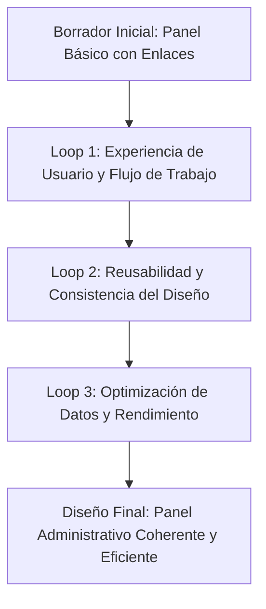
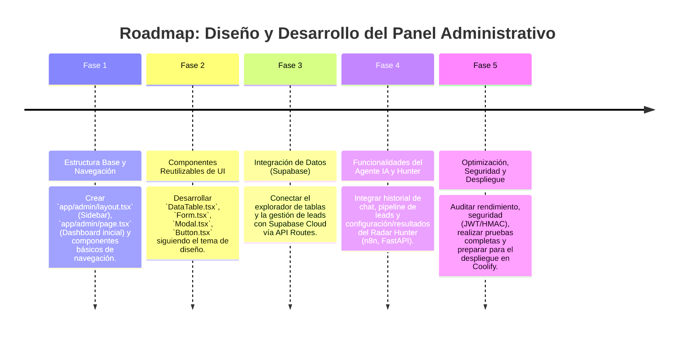

# 🖥️ Plan de Implementación: Diseño del Panel Administrativo de AgenciAlquimia

Este documento describe el plan de implementación para el diseño y desarrollo del panel administrativo (`/admin`) de AgenciAlquimia. El objetivo es crear una interfaz de gestión robusta, intuitiva y estéticamente coherente con la identidad de marca, que permita a Matías (y futuros usuarios autorizados) gestionar eficientemente los aspectos clave del negocio.

---

## 1. 🎯 Objetivo Estratégico

El panel administrativo debe ser el **centro de control operativo** de AgenciAlquimia, proporcionando una visión consolidada y herramientas interactivas para:

*   **Gestión de Leads:** Visualización del pipeline, scoring, contacto.
*   **Monitoreo del Agente IA:** Historial de conversaciones, entrenamiento, ajuste de parámetros.
*   **Administración de Contenido/Servicios:** Gestión de servicios, precios, y otros contenidos dinámicos de la web.
*   **Acceso a Datos:** Explorador de tablas Supabase, informes y métricas.
*   **Operaciones del Radar Hunter:** Configuración y visualización de resultados de scraping.

El diseño debe priorizar la **eficiencia del flujo de trabajo, la claridad de la información y la coherencia visual**.

---

## 2. 🧙‍♂️ Análisis de la Propuesta mediante el Método de los 3 Expertos

### 🎨 Experto 1: Diseñador UX/UI & Estratega de Producto
*   **Análisis:** La clave es la usabilidad y la reducción de la carga cognitiva. El diseño debe ser funcional, pero también estético, utilizando el sistema de diseño Dark Charcoal/Esmeralda existente. La navegación debe ser clara y el acceso a las funciones más frecuentes, rápido. La información crítica debe ser destacada visualmente.
*   **Decisión:** Priorizar un layout responsivo y modular (componentes reutilizables). Implementar un sistema de navegación lateral persistente (`Sidebar`) para las secciones principales (Dashboard, Leads, IA, Data, Hunter). Utilizar tarjetas (`Card`) para agrupar información y acciones relacionadas.

### ⚙️ Experto 2: Ingeniero Frontend & Especialista en Rendimiento (Next.js/React/TS)
*   **Análisis:** El uso de Next.js App Router permite un diseño modular y la optimización de la carga de páginas (SSR/SSG). La comunicación con el backend (Supabase, FastAPI, n8n) debe ser eficiente, utilizando API Routes server-side para proteger las credenciales y procesar datos. Reutilizar componentes existentes del frontend público es clave para la consistencia y la velocidad de desarrollo.
*   **Decisión:** Diseñar componentes de UI genéricos (ej. `DataTable`, `Form`, `Modal`, `Button`) que puedan ser reutilizados en todas las secciones del panel. Optimizar la obtención de datos (`fetch`) para evitar re-renderizados innecesarios y asegurar una carga rápida de la interfaz. Implementar un manejo de estado eficiente con React Hooks.

### 📈 Experto 3: Especialista en DevOps, Escalabilidad & Seguridad
*   **Análisis:** El panel debe ser seguro por diseño. Esto implica proteger todas las API Routes con autenticación JWT, implementar validaciones de entrada en el backend y monitorear el rendimiento del servidor. La escalabilidad dependerá de la eficiencia del código y de cómo se gestionen las llamadas a los microservicios externos (FastAPI, n8n).
*   **Decisión:** Todas las API Routes (`/api/admin/*`) deben estar protegidas con el JWT de administración. Implementar un monitoreo básico de rendimiento (ej. tiempos de respuesta de las APIs) para identificar cuellos de botella. Asegurar que las interacciones con microservicios externos (FastAPI/n8n) se realicen con la autenticación interna adecuada (HMAC).

---

## 3. 🔄 Self-Refinement Loop (3 Ciclos de Refinamiento Iterativo)

### 🔁 Ciclo 1: Experiencia de Usuario y Flujo de Trabajo
*   **Planteamiento Inicial:** Un panel con links a cada funcionalidad.
*   **Crítica de Refinamiento:** Una lista simple de enlaces no es suficiente para una experiencia de usuario eficiente. Se necesita una visión más holística del flujo de trabajo de Matías.
*   **Solución Refinada:** Diseñar un Dashboard inicial con métricas clave (ej. leads nuevos, conversaciones activas, estado del agente IA). Implementar un sistema de navegación lateral (`Sidebar`) que permita un acceso rápido y persistente a las secciones. Priorizar la información que Matías necesita ver de un vistazo.

### 🔁 Ciclo 2: Reusabilidad y Consistencia del Diseño
*   **Planteamiento Inicial:** Crear componentes específicos para cada sección del panel.
*   **Crítica de Refinamiento:** Esto podría llevar a la duplicación de código y a inconsistencias visuales si no se gestiona bien. El sistema de diseño Dark Charcoal/Esmeralda debe aplicarse de forma homogénea.
*   **Solución Refinada:** Identificar componentes de UI recurrentes (tablas, formularios, botones, modales, alertas) y diseñarlos como componentes reutilizables (`components/admin/DataTable.tsx`, `components/admin/Form.tsx`). Establecer un `design token` para el panel (ej. `panel-layout.css` si es necesario) o directrices claras para el uso de clases de Tailwind.

### 🔁 Ciclo 3: Optimización de Datos y Rendimiento
*   **Planteamiento Inicial:** Cargar todos los datos de una sección de golpe al entrar en ella.
*   **Crítica de Refinamiento:** Cargar grandes volúmenes de datos puede ralentizar la interfaz y agotar los recursos del navegador/servidor. La interacción con Supabase y n8n debe ser lo más eficiente posible.
*   **Solución Refinada:** Implementar paginación y filtros en las tablas de datos (`DataTable.tsx`). Utilizar la carga de datos del lado del servidor (API Routes) para minimizar el trabajo del cliente. Considerar técnicas de `debouncing` para filtros y búsquedas. Optimizar las llamadas a los microservicios externos para evitar latencias innecesarias.

---

## 4. 🗺️ Roadmap de Implementación por Fases

---

**Fecha de Creación:** 2026-08-22
**Autor:** Mercurio (Agente IA de OpenClaw)
