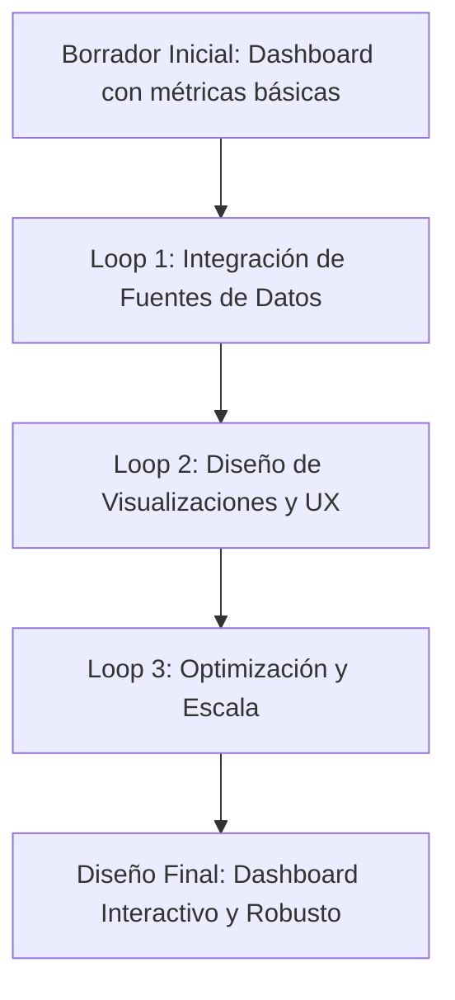
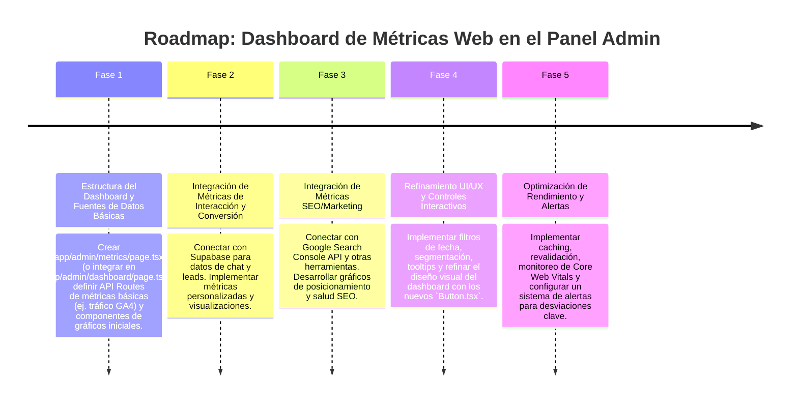

# 📈 Plan de Implementación: Dashboard de Métricas Web en el Panel Administrativo

Este documento describe el plan para integrar un dashboard de métricas clave (Tráfico, Interacción, Conversión, SEO/Marketing y Contenido) directamente en el panel administrativo (`/admin`) de AgenciAlquimia. El objetivo es proporcionar a Matías una visión consolidada y accionable del rendimiento de la web, el funnel de ventas y el impacto del Agente IA, facilitando la toma de decisiones basada en datos.

---

## 1. 🎯 Objetivo Estratégico

Desarrollar una sección dedicada en el panel administrativo (`/admin/dashboard` o `/admin/metrics`) que centralice la visualización de métricas críticas. Este dashboard permitirá:

*   **Monitorear el rendimiento:** Evaluar la salud de la web y la efectividad de las estrategias de SEO/Marketing.
*   **Optimizar conversiones:** Identificar cuellos de botella en el funnel y el rendimiento de las CTAs.
*   **Evaluar el impacto de la IA:** Medir la interacción y la eficiencia del Agente IA en la cualificación de leads.
*   **Facilitar la toma de decisiones:** Presentar los datos de forma clara y procesable para guiar futuras optimizaciones.

---

## 2. 🧙‍♂️ Análisis de la Propuesta mediante el Método de los 3 Expertos

### 📈 Experto 1: Analista de Negocio & Growth Marketing
*   **Análisis:** El dashboard debe ser un "cuadro de mando" que responda a preguntas de negocio clave, no solo mostrar datos. La correlación entre tráfico, interacción, conversión y SEO es fundamental. La segmentación de datos y la visualización de tendencias son críticas para identificar oportunidades.
*   **Decisión:** Diseñar el dashboard con secciones claras para cada grupo de métricas. Utilizar gráficos de tendencias (líneas, barras) para mostrar el rendimiento a lo largo del tiempo. Implementar filtros de fecha y segmentación (ej. por fuente de tráfico, por campaña) para un análisis más profundo. Destacar KPIs clave (ej. % de conversión de lead) en tarjetas de resumen.

### ⚙️ Experto 2: Ingeniero Frontend & Arquitecto de Datos (Next.js/Supabase)
*   **Análisis:** La recolección de datos provendrá de múltiples fuentes (Google Analytics, Supabase para interacciones de chat/leads, posiblemente APIs SEO externas). La integración debe ser eficiente, asíncrona y no sobrecargar el cliente. La visualización de datos requiere librerías de gráficos performantes.
*   **Decisión:** Crear API Routes server-side (`/api/admin/metrics/*`) para consolidar y procesar los datos de diferentes fuentes antes de enviarlos al frontend. Utilizar librerías de gráficos ligeras y reactivas (ej. `recharts`, `react-chartjs-2`). Implementar caching a nivel de API Route si las llamadas a fuentes externas son costosas o lentas. Asegurar la modularidad de los componentes de gráficos.

### 🔐 Experto 3: Líder de Seguridad, Privacidad & DevOps
*   **Análisis:** La consolidación de datos de analítica (tráfico, SEO) requiere consideración de privacidad (GDPR). Si se usan APIs externas (ej. Google Analytics Data API, Google Search Console API, herramientas SEO), las credenciales deben ser gestionadas de forma segura (variables de entorno, autenticación OAuth). El rendimiento del dashboard no debe impactar el VPS.
*   **Decisión:** Las llamadas a APIs externas de analítica y SEO se realizarán desde el backend (Next.js API Routes), no desde el cliente, para proteger las credenciales y anonimizar datos si es necesario. Asegurar que las credenciales de estas APIs se almacenen de forma segura en `.env.local` y/o en Coolify. Monitorear el consumo de recursos del VPS durante la carga y actualización del dashboard.

---

## 3. 🔄 Self-Refinement Loop (3 Ciclos de Refinamiento Iterativo)

### 🔁 Ciclo 1: Integración de Fuentes de Datos
*   **Planteamiento Inicial:** Mostrar datos básicos de tráfico desde una única fuente (ej. una cuenta de Google Analytics).
*   **Crítica de Refinamiento:** Para un dashboard integral, se necesitan múltiples fuentes: Google Analytics (tráfico, comportamiento), Supabase (interacciones de chat, leads cualificados), Google Search Console (SEO SERP). La integración debe ser sinérgica.
*   **Solución Refinada:** Desarrollar adaptadores de datos (`lib/data-sources/*`) para cada fuente. Crear API Routes en Next.js que consoliden y transformen estos datos en un formato uniforme para el frontend. Implementar la API Data de Google Analytics y la API de Google Search Console para obtener datos programáticamente desde el backend.

### 🔁 Ciclo 2: Diseño de Visualizaciones y Experiencia de Usuario (UX)
*   **Planteamiento Inicial:** Gráficos estándar para cada métrica.
*   **Crítica de Refinamiento:** Un simple conjunto de gráficos puede abrumar. La información debe ser presentada de forma jerárquica, interactiva y accionable. La estética Dark Charcoal/Esmeralda debe aplicarse consistentemente.
*   **Solución Refinada:** Diseñar un layout de dashboard con "cards" para KPIs resumen, gráficos de tendencias para evolución, y tablas de desglose para detalles (ej. páginas más visitadas, principales palabras clave). Implementar funcionalidades de `tooltip` interactivo, rangos de fecha personalizados y filtros de segmentación (`Dropdown`, `Select`). Utilizar el componente `Button.tsx` elegante.

### 🔁 Ciclo 3: Optimización y Escala
*   **Planteamiento Inicial:** Cargar todos los datos del dashboard en cada visita.
*   **Crítica de Refinamiento:** Las llamadas a APIs externas y el procesamiento de datos pueden generar latencia y consumo excesivo de recursos si el dashboard se escala con muchos usuarios o datos históricos extensos.
*   **Solución Refinada:** Implementar una estrategia de `revalidación` en las API Routes de Next.js para los datos del dashboard (ej. `revalidate = 3600` para datos que no necesitan ser en tiempo real). Considerar una caché en memoria o Redis en el backend si la agregación de datos es muy intensiva. Optimizar las consultas a Supabase y a las APIs externas.

---

## 4. 🗺️ Roadmap de Implementación por Fases

---

**Fecha de Creación:** 2026-08-22
**Autor:** Mercurio (Agente IA de OpenClaw)
