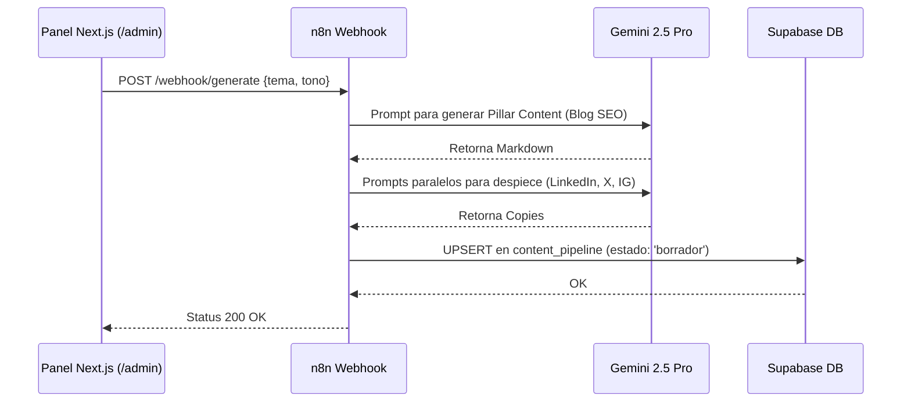

# Análisis Conjunto: Arquitectura de Marketing Automatizado

Este documento presenta una comparativa y síntesis entre los dos enfoques de diseño planteados para la plataforma de AgenciAlquimia:
1. `marketing-advertising-automation-architecture.md` (Visión Estratégica y Estructura Global)
2. `motor-contenido-ads.md` (Implementación Técnica y Filosofía "Pillar Content")

---

## 1. Puntos de Convergencia (Lo que tienen en común)

Ambos documentos coinciden perfectamente en la **arquitectura tecnológica y el flujo de trabajo básico**:
- **Stack Central:** Uso de **Next.js 15** (para el frontend / panel admin), **n8n** (como orquestador/motor de procesos) y una base de datos (se especifica **Supabase** en el segundo documento).
- **Pipeline de Generación Múltiple:** El principio de "Crear una vez, distribuir en todas partes". Ambos mencionan partir de un tema o semilla para generar un artículo de Blog principal y luego derivarlo hacia LinkedIn, X (Twitter) e Instagram/Meta.
- **Flujo de Publicación (Human-in-the-Loop):** Coinciden en la necesidad de un estado intermedio (`Borrador` o `Pendiente`) donde un humano puede revisar en un "Kanban" o "Calendario" dentro de `/admin` antes de aprobar su publicación.
- **Sincronización de Métricas (ETL asíncrono):** Para evitar bloqueos y lentitud, ambos documentos establecen tajantemente que n8n debe ejecutarse en segundo plano (cronjob/intervalos), extraer datos de Meta Ads / Google Ads y hacer un upsert a la base de datos local para que Next.js consuma con "latencia cero".

## 2. Puntos Complementarios y Diferencias de Enfoque

| Característica | `marketing-advertising-automation-architecture` (Doc A) | `motor-contenido-ads` (Doc B) | Análisis / Sinergia |
| :--- | :--- | :--- | :--- |
| **Enfoque Principal** | Estrategia de producto, Módulos funcionales, UI/UX y Fases de negocio. | Base de datos (Schemas), Flujo n8n (ETL) y Renderizado (Markdown). | **Complemento Perfecto:** Doc A define *qué* vamos a construir y cómo interactúa el usuario; Doc B define el *esquema de datos* subyacente. |
| **Generación de Contenido** | Habla de "Repurposing", modos Asistido vs Autónomo y dictado por audio. | Introduce la filosofía **"Pillar Content"** y el uso específico de Gemini 2.5 Pro. | Al unir ambos, logramos un sistema robusto: Se dicta un audio (Doc A) $\rightarrow$ Gemini crea un Pillar Content (Doc B) $\rightarrow$ Spin-offs a redes. |
| **Estructura de Base de Datos** | Abstracta ("Base de datos / Cache"). | Detallada: Propone esquemas exactos (`content_pipeline`, `campaign_metrics`). | Debemos adoptar las tablas precisas definidas en Doc B como estándar de desarrollo. |
| **Publicación de Anuncios (Ads)** | Incluye la creación de copys para Ads y automatización de presupuestos (pausar CPA alto). | Se centra casi exclusivamente en la *lectura* de métricas de Ads, no en su creación. | El ecosistema final debe incluir ambos: lectura (Doc B) y reglas activas de detención/creación (Doc A). |
| **Renderizado en Front-end** | Menciona Next.js MDX/CMS de forma genérica. | Especifica dependencias técnicas vitales: `react-markdown` y `@tailwindcss/typography`. | Adoptaremos la especificación técnica de Doc B para mantener la estética Dark Charcoal `#0b0d10`. |

---

## 3. Arquitectura Unificada (La Síntesis Definitiva)

Al fusionar ambos documentos, obtenemos el mapa de ruta definitivo para implementar el sistema:

### Fase de Datos (Back-end y ETL)
1. **Supabase Cloud** con las tablas `content_pipeline` (estado, copys, markdown) y `campaign_metrics` (gasto, leads, ROAS).
2. **Workflows en n8n**:
   - *Flujo A (Creación)*: Recibe un trigger (vía webhook desde Next.js), usa Gemini 2.5 Pro para generar el "Pillar Content" (Blog) y extrae los *spin-offs* (X, LinkedIn, IG). Guarda en `content_pipeline` como `borrador`.
   - *Flujo B (Publicación)*: Escucha el trigger de "aprobado" y publica en APIs sociales.
   - *Flujo C (Métricas/Seguridad)*: Cronjob cada hora extrayendo datos de Meta/Google Ads hacia `campaign_metrics` + Evalúa reglas de presupuesto (CPA alto $\rightarrow$ pausa campaña).

### Fase de Interfaz (Front-end - Next.js)
1. **`/admin/marketing`**: Panel principal con Kanban de `borradores` y el Dashboard Analítico consumiendo desde `campaign_metrics`.
2. **`/blog/[slug]`**: Motor de blog usando `react-markdown` y el plugin de tipografía de Tailwind para mantener consistencia con los colores esmeralda de AgenciAlquimia.

> [!TIP]
> **Siguiente paso recomendado:** Utilizar los esquemas de base de datos definidos en el *Doc B* para configurar el entorno de Supabase, y las directrices de UI del *Doc A* para empezar a maquetar el panel Kanban en `/admin`.

---

## 4. Esquema de Base de Datos (Supabase SQL)

A continuación, se define la estructura relacional crítica en PostgreSQL para soportar el flujo.

### Tabla `content_pipeline`
```sql
CREATE TABLE content_pipeline (
  id UUID PRIMARY KEY DEFAULT uuid_generate_v4(),
  tema TEXT NOT NULL,
  blog_slug TEXT UNIQUE,
  blog_md TEXT,
  copy_linkedin TEXT,
  copy_x TEXT,
  copy_ig TEXT,
  estado VARCHAR(50) CHECK (estado IN ('borrador', 'pendiente_aprobacion', 'publicado')),
  fecha_programada TIMESTAMPTZ,
  created_at TIMESTAMPTZ DEFAULT NOW(),
  updated_at TIMESTAMPTZ DEFAULT NOW()
);
```

### Tabla `campaign_metrics`
```sql
CREATE TABLE campaign_metrics (
  id UUID PRIMARY KEY DEFAULT uuid_generate_v4(),
  plataforma VARCHAR(50) NOT NULL, -- 'Meta', 'Google', 'LinkedIn'
  campana_id TEXT NOT NULL UNIQUE,
  campana_nombre TEXT,
  gasto_total NUMERIC(10, 2) DEFAULT 0.0,
  clics INTEGER DEFAULT 0,
  leads INTEGER DEFAULT 0,
  cpa_actual NUMERIC(10, 2) GENERATED ALWAYS AS (CASE WHEN leads > 0 THEN gasto_total / leads ELSE 0 END) STORED,
  last_synced_at TIMESTAMPTZ DEFAULT NOW()
);
```

---

## 5. Diagramas de Flujo y Orquestación

### Flujo de Generación de Contenido (Pillar Content)



### Bucle de Control de Anuncios (ETL & Reglas)

```mermaid
flowchart TD
    A[Cronjob n8n (Cada hora)] --> B[Fetch Meta Ads API]
    A --> C[Fetch Google Ads API]
    B --> D[Upsert a campaign_metrics]
    C --> D
    D --> E{¿CPA Actual > Umbral Permitido?}
    E -- Sí --> F[Pausar Campaña en Plataforma]
    F --> G[Enviar Alerta WhatsApp/Telegram]
    E -- No --> H[Continúa activo]
```

---

## 6. Contratos de API (Next.js App Router)

Se requieren endpoints internos (`Route Handlers`) en `app/api/marketing/` para proteger las claves de n8n y no exponerlas al cliente:

- **`POST /api/marketing/generate`**: 
  - Recibe `{ tema, tone }` desde el panel cliente.
  - Ejecuta fetch seguro (Server-side) inyectando JWT/API Keys hacia el webhook de n8n de ideación.
- **`POST /api/marketing/publish`**:
  - Recibe el `id` de la tabla `content_pipeline`.
  - Cambia el estado en BD a `publicado`.
  - Dispara webhook a n8n para programar/publicar en las APIs sociales.

---

## 7. Roadmap de Ejecución Técnica

1. **Fase 1 (Backbone & DB):** Ejecutar las migraciones SQL en Supabase y configurar Row Level Security (RLS) en `campaign_metrics`.
2. **Fase 2 (Generador IA):** Implementar el workflow de n8n orquestando a Gemini 2.5 Pro.
3. **Fase 3 (UI de Aprobación):** Desarrollar el panel Kanban en `/admin/marketing` leyendo los borradores con Server Actions de Next.js.
4. **Fase 4 (Métricas y ETL):** Crear los flujos programados en n8n para sincronizar rendimiento publicitario cada hora.
