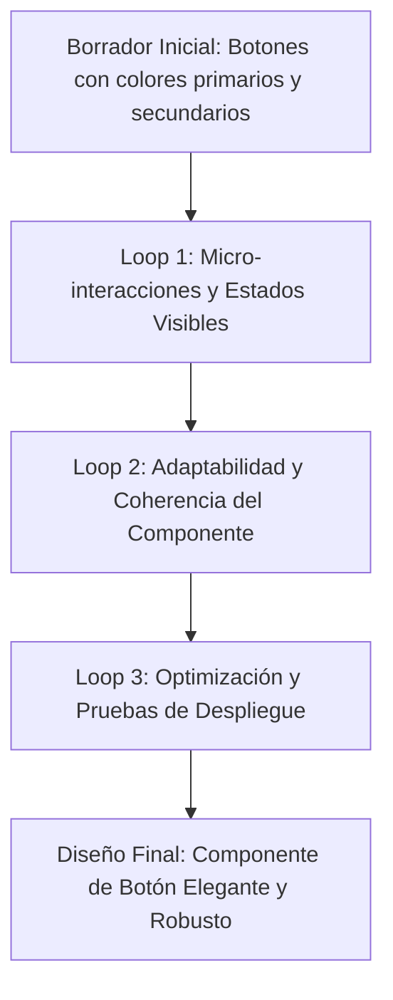
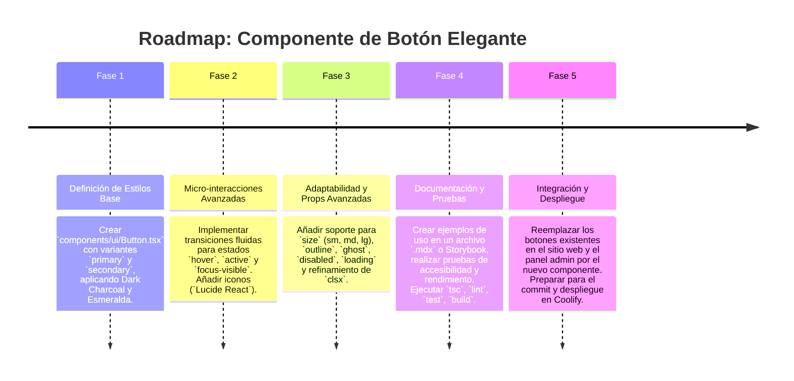

# ✨ Plan de Implementación: Diseño de Botones Elegantes (Tonalidad Oscura)

Este documento describe el plan para diseñar e implementar un set de botones con un estilo elegante y sofisticado, manteniendo la tonalidad oscura y la identidad de marca de AgenciAlquimia. Se aplicarán principios de la `code-refinement-suite` para asegurar un diseño de alta calidad, coherencia y eficiencia.

---

## 1. 🎯 Objetivo Estratégico

Elevar la percepción de calidad y profesionalismo de la interfaz de AgenciAlquimia (tanto en el sitio público como en el panel administrativo) mediante un diseño de botones que sea visualmente atractivo, intuitivo, y que refleje una estética "premium" dentro del esquema de color Dark Charcoal y Esmeralda. Los botones deben ser funcionales, accesibles y consistentes en todo el ecosistema.

---

## 2. 🧙‍♂️ Análisis de la Propuesta mediante el Método de los 3 Expertos

### 🎨 Experto 1: Diseñador UX/UI & Branding
*   **Análisis:** Un diseño de botón "elegante" en un tema oscuro implica una combinación de tipografía refinada, transiciones sutiles, estados de hover/active bien definidos, y posiblemente un uso estratégico de degradados o sombras sutiles. La clave es la "sensación" al interactuar. Los iconos deben complementar, no dominar.
*   **Decisión:** Definir una paleta de micro-interacciones (hover, focus, active) que refinen los colores esmeralda y el fondo oscuro. Usar tipografía `Inter` (existente) para el texto de los botones. Considerar sutiles bordes o sombras internas para dar profundidad sin ser intrusivo. Priorizar la jerarquía visual de los botones (Primario, Secundario, Terciario).

### ⚙️ Experto 2: Ingeniero Frontend & Especialista en CSS (TailwindCSS v4)
*   **Análisis:** TailwindCSS v4 es ideal para implementar este tipo de diseño de forma atómica y consistente. Se pueden crear clases utilitarias o componentes que encapsulen los estilos para evitar la duplicación. Las transiciones deben ser fluidas y eficientes para no impactar el rendimiento. La responsividad es clave.
*   **Decisión:** Crear un componente `Button.tsx` centralizado que gestione todos los estilos de los botones (primario, secundario, etc.). Utilizar las clases `group` de Tailwind para coordinar estados de hover de texto e icono. Implementar animaciones CSS de forma performante (ej. transform, opacity) en lugar de propiedades que fuerzan el `layout` o `paint`.

### 📈 Experto 3: Especialista en Accesibilidad & Mantenibilidad
*   **Análisis:** La elegancia no debe comprometer la accesibilidad. Los ratios de contraste de texto y fondo deben cumplir WCAG 2.1 AA. El foco debe ser claro para la navegación por teclado. La semántica HTML (`<button>`) debe ser correcta.
*   **Decisión:** Asegurar que los colores en todos los estados (normal, hover, active, disabled) cumplan con los requisitos de contraste. Implementar un `outline` visible y consistente para el estado `:focus-visible`. Documentar las variantes de botones y su uso para mantener la consistencia en el equipo.

---

## 3. 🔄 Self-Refinement Loop (3 Ciclos de Refinamiento Iterativo)

### 🔁 Ciclo 1: Micro-interacciones y Estados Visibles
*   **Planteamiento Inicial:** Botones con un color de fondo y texto fijo, con un cambio de color simple en hover.
*   **Crítica de Refinamiento:** Para la elegancia, se necesitan transiciones más sutiles y estados más definidos. Un cambio brusco o poco diferenciado no comunica calidad.
*   **Solución Refinada:** Introducir transiciones CSS de `background-color`, `border-color` y `box-shadow` con una duración corta (ej. `200ms ease-out`). Definir estados `hover` y `active` con variaciones sutiles de color (más oscuros para el fondo oscuro, más brillantes/saturados para el esmeralda). Considerar un sutil `scale` o `translateY` en `active` para un feedback táctil.

### 🔁 Ciclo 2: Adaptabilidad y Coherencia del Componente
*   **Planteamiento Inicial:** Estilos definidos directamente en JSX para cada botón.
*   **Crítica de Refinamiento:** Esto lleva a la inconsistencia y dificultad de mantenimiento. La elegancia se pierde si cada botón se ve o se comporta de forma diferente.
*   **Solución Refinada:** Crear un componente `Button.tsx` genérico que acepte props para `variant` (ej. `primary`, `secondary`, `outline`, `ghost`), `size` (ej. `sm`, `md`, `lg`), `icon` (opcional), `disabled` y `loading`. Utilizar `clsx` o `class-variance-authority` para gestionar las clases condicionalmente, asegurando que todos los botones de un mismo tipo tengan la misma estética y comportamiento.

### 🔁 Ciclo 3: Optimización y Pruebas de Despliegue
*   **Planteamiento Inicial:** Implementar estilos sin pensar en el tamaño del bundle o la reutilización de clases.
*   **Crítica de Refinamiento:** Un diseño elegante no debe añadir un peso innecesario al bundle de CSS ni causar repainting/reflows costosos. La integración con TailwindCSS debe ser óptima.
*   **Solución Refinada:** Asegurar que todas las clases CSS utilizadas provengan de TailwindCSS o sean mínimas y bien justificadas. Auditar el componente con las herramientas de desarrollo del navegador para verificar que las transiciones sean fluidas (`60fps`) y que no haya problemas de rendimiento. Crear un Storybook (o componente de demo) para visualizar todas las variantes y estados del botón.

---

## 4. 🗺️ Roadmap de Implementación por Fases

---

**Fecha de Creación:** 2026-08-22

**Autor:** Mercurio (Agente IA de OpenClaw)

