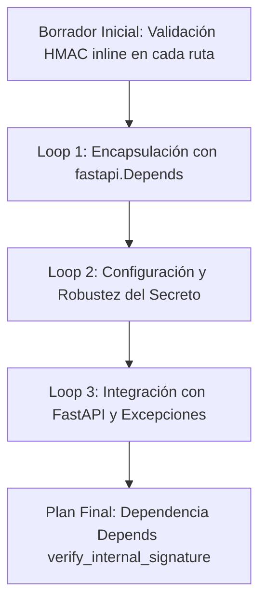
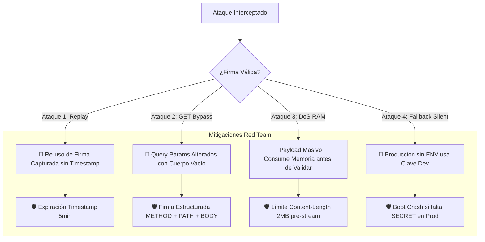
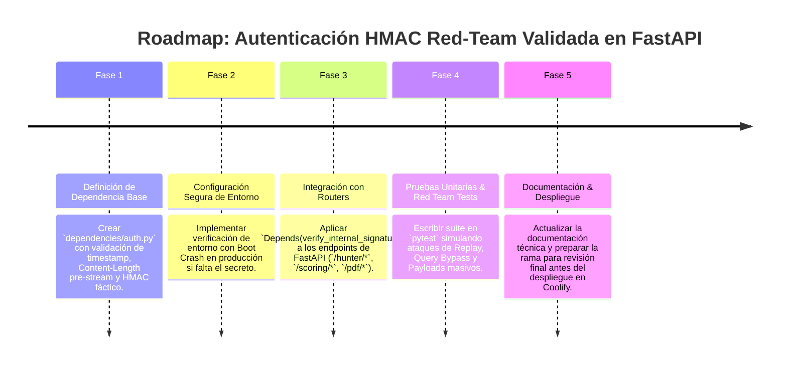

# 🛡️ Plan de Implementación: Autenticación Interna HMAC en FastAPI

Este documento describe el plan para implementar un sistema de autenticación basado en HMAC SHA-256 en el microservicio Python de FastAPI de AgenciAlquimia. El objetivo es reforzar la seguridad inter-servicios y modularizar la validación de firmas internas.

---

## 1. 🎯 Objetivo Estratégico

Centralizar y simplificar la validación de la firma `X-Internal-Signature` en los endpoints de FastAPI, asegurando que solo las peticiones legítimas provenientes de servicios internos (como el frontend Next.js) sean procesadas. Esto mejora la seguridad, la legibilidad del código y la reusabilidad de la lógica de autenticación.

---

## 2. 🧙‍♂️ Análisis de la Propuesta mediante el Método de los 3 Expertos

### 🔐 Experto 1: Líder de Seguridad & Criptografía
*   **Análisis:** La implementación de HMAC (Hash-based Message Authentication Code) con SHA-256 es una elección sólida para la autenticación inter-servicios. Proporciona integridad y autenticidad del mensaje, previniendo manipulaciones y suplantaciones. Encapsular esta lógica minimiza la posibilidad de errores de implementación dispersos.
*   **Decisión:** Confirmar el uso de `hmac.compare_digest` para prevenir ataques de temporización, asegurar que el secreto (`PYTHON_INTERNAL_SECRET`) se obtenga de forma segura (variables de entorno) y que la validación ocurra antes de cualquier procesamiento de la lógica de negocio del endpoint.

### ⚙️ Experto 2: Arquitecto de Python & FastAPI
*   **Análisis:** FastAPI proporciona un sistema nativo de dependencias (`fastapi.Depends`). Usar `Depends` en lugar de un decorador `@wraps` tradicional evita problemas de consumo de stream de datos (`StreamConsumed`) en Starlette.
*   **Decisión:** Implementar la autenticación como una dependencia inyectable `Depends(verify_internal_signature)`, permitiendo su aplicación a nivel de ruta o a nivel de `APIRouter`. Asegurar la correcta propagación de excepciones de FastAPI (`HTTPException`) en caso de fallo.

### 📈 Experto 3: Especialista en DevOps & Mantenibilidad
*   **Análisis:** Una dependencia centralizada facilita el despliegue, la configuración y el mantenimiento. El secreto interno debe ser una variable de entorno gestionada por Coolify.
*   **Decisión:** Documentar claramente la dependencia, su uso y la forma en que el `PYTHON_INTERNAL_SECRET` debe configurarse en el entorno de producción (Coolify) y desarrollo (`.env`). Implementar pruebas unitarias para asegurar su correcto funcionamiento.

---

## 3. 🔄 Self-Refinement Loop (3 Ciclos de Refinamiento Iterativo)

### 🔁 Ciclo 1: Encapsulación y Reusabilidad
*   **Planteamiento Inicial:** Repetir la lógica de verificación HMAC en cada endpoint.
*   **Crítica de Refinamiento:** Lleva a la duplicación de código y mayor superficie de error.
*   **Solución Refinada:** Crear la dependencia `verify_internal_signature` inyectable vía `Depends()` que encapsule la validación.

### 🔁 Ciclo 2: Configuración y Robustez del Secreto
*   **Planteamiento Inicial:** Hardcodear el secreto HMAC para desarrollo.
*   **Crítica de Refinamiento:** Hardcodear secretos es una vulnerabilidad mayor.
*   **Solución Refinada:** Cargar `PYTHON_INTERNAL_SECRET` desde variables de entorno. En desarrollo desde `.env`; en producción gestionado por Coolify.

### 🔁 Ciclo 3: Integración con FastAPI y Manejo de Excepciones
*   **Planteamiento Inicial:** Detener la ejecución sin mensaje HTTP estándar.
*   **Crítica de Refinamiento:** La API debe responder con códigos HTTP estándar para que Next.js maneje los errores de forma predecible.
*   **Solución Refinada:** Lanzar `fastapi.HTTPException(status_code=403, detail="Signature verification failed")`.

---

## 4. 🥊 Análisis Adversarial (Red Teaming) y Mitigaciones

### 🔴 4.1. Ataques de Reproducción (Replay Attacks)
* **Vulnerabilidad:** Sin ventana de tiempo, una firma capturada puede ser reutilizada indefinidamente.
* **Mitigación Red Team:** Firmar la cabecera `X-Internal-Timestamp` y rechazar si `abs(ahora - timestamp) > 300` segundos (5 minutos).

### 🔴 4.2. Bypass en Peticiones `GET` o sin Cuerpo
* **Vulnerabilidad:** Peticiones sin cuerpo comparten la misma firma estática sobre cadena vacía. Un atacante podría alterar los Query Params (`?id=999`).
* **Mitigación Red Team:** Firmar la cadena estructurada: `METHOD + ":" + PATH + ":" + TIMESTAMP + ":" + BODY_HASH`.

### 🔴 4.3. Denegación de Servicio por Agotamiento de RAM (Stream DoS)
* **Vulnerabilidad:** Leer `request.body()` en memoria antes de autenticar expone al servidor a consumir payloads masivos de 500 MB en RAM.
* **Mitigación Red Team:** Verificar `Content-Length`. Si supera **2 MB**, abortar con `HTTP 413 Payload Too Large` antes de leer el cuerpo.

### 🔴 4.4. Riesgo de Fallback Silencioso en Producción
* **Vulnerabilidad:** Si en Coolify se olvida declarar `PYTHON_INTERNAL_SECRET`, usar un fallback por defecto permitiría que cualquiera suplante firmas.
* **Mitigación Red Team:** Si `ENVIRONMENT == "production"` y falta la clave, la aplicación debe lanzar un **Fallo Crítico al Arrancar (Fatal Boot Crash)**.

### 🔴 4.5. Conflicto de Stream Consumido en FastAPI
* **Vulnerabilidad:** Usar un decorador de función tradicional (`@wraps`) consume el stream de la petición Starlette impidiendo que Pydantic lea el cuerpo luego.
* **Mitigación Red Team:** Implementar la validación utilizando `fastapi.Depends(verify_internal_signature)`.

---

## 5. 🗺️ Roadmap de Implementación por Fases

---

**Fecha de Actualización:** 2026-08-22  
**Autor:** Mercurio (Agente IA de OpenClaw)
