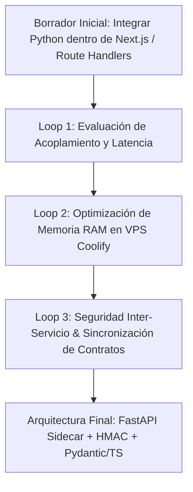
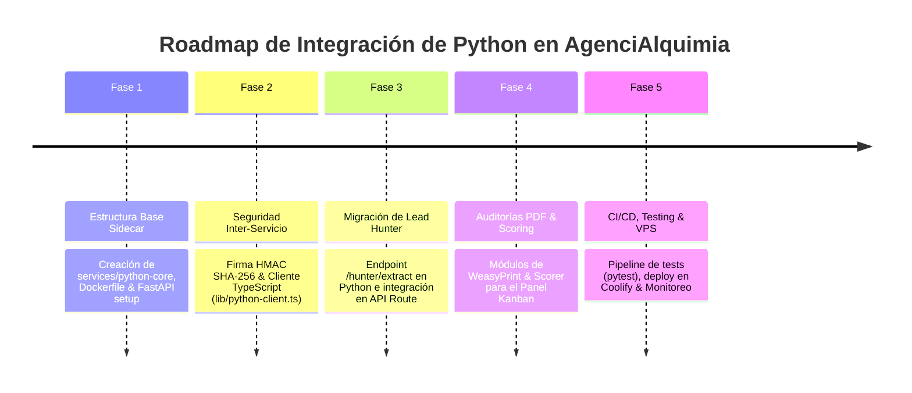

# 🐍 Plan de Integración de Python en AgenciAlquimia: Arquitectura, Análisis de Expertos y Roadmap por Fases

Este documento presenta una propuesta técnica completa para integrar **Python 3.12+** en el ecosistema informático de **AgenciAlquimia Web** (actualmente basado en Next.js 15, React 19, TypeScript estricto, Supabase Cloud y n8n).

---

## 1. 🎯 Por qué aplicar Python en AgenciAlquimia (Justificación Técnica & Estratégica)

AgenciAlquimia es una agencia especializada en **automatización con Inteligencia Artificial para pymes y negocios locales**. Aunque el stack actual con Next.js 15 (App Router) y TypeScript es ideal para la web corporativa y el panel de administración, la expansión de servicios exige capacidades avanzadas en:

1. **Scraping y Extracción masiva de datos:** Procesar sitios web complejos de negocios en Galicia (Lead Hunter) con navegadores headless en paralelo.
2. **Procesamiento de Lenguaje Natural (NLP) y RAG:** Búsqueda semántica, vectorización y estructuración de respuestas de IA sin depender exclusivamente de webhooks de n8n.
3. **Data Science y Scoring Predictivo:** Analizar y clasificar el potencial de conversión de prospectos mediante modelos matemáticos y de Machine Learning.
4. **Generación Dinámica de Documentos:** Crear informes de auditoría en PDF altamente diseñados para prospección comercial.

Python es el estándar de la industria en IA y Data Science. Su integración mediante una arquitectura de **microservicio sidecar (FastAPI)** complementa a Next.js sin alterar la velocidad ni la elegancia del frontend en TypeScript.

---

## 2. 🧙‍♂️ Análisis de la Propuesta mediante el Método de los 3 Expertos

### 🛡️ Experto 1: Arquitecto de Infraestructura & Microservicios (FastAPI + Coolify)
- **Análisis:** Recomienda **no mezclar** el runtime de Python en el contenedor de Next.js. La mejor práctica es desplegar un contenedor independiente `agencialquimia-python-core` basado en **FastAPI** en la misma red de Docker de Coolify (VPS).
- **Decisión:** Comunicación privada mediante peticiones HTTP/REST asíncronas de baja latencia (`<5ms`) utilizando la red de Docker interna (`http://python-core:8000`).

### 🔬 Experto 2: Ingeniero de Inteligencia Artificial, Data & Web Scraping
- **Análisis:** Resalta que el scraping actual en Node.js mediante expresiones regulares en `fetch` es frágil frente a sitios dinámicos (SPA, React/Vue, protecciones Cloudflare/Wix). 
- **Decisión:** Utilizar Python con `Playwright-stealth` y `selectolax` (parser C ultra-rápido) para la prospección en Lead Hunter, garantizando un 99% de tasa de éxito en extracción de contactos reales.

### 🔐 Experto 3: Líder de Seguridad, DevOps & Mantenibilidad
- **Análisis:** Advierte sobre el consumo de memoria en el VPS y los riesgos de exponer endpoints sin proteger.
- **Decisión:** Implementar autenticación inter-servicio mediante **HMAC SHA-256** (`X-Internal-Signature`) y limitar el uso de memoria RAM del contenedor Python en Coolify a máximo 350 MB usando ejecución asíncrona (`asyncio` / `uvicorn`).

---

## 3. 🔄 Self-Refinement Loop (3 Ciclos de Refinamiento Iterativo)



### 🔁 Ciclo 1: Evaluación de Acoplamiento y Latencia
- **Planteamiento Inicial:** ¿Ejecutar scripts de Python invocándolos como subprocesos (`child_process.spawn`) desde la API Route de Next.js?
- **Crítica de Refinamiento:** Invocar procesos `python3 script.py` en cada petición genera una sobrecarga de arranque de runtime (overhaed de 300ms a 800ms) y puede agotar los recursos del servidor web.
- **Solución Refinada:** Crear un servicio FastAPI residente en memoria (`uvicorn`), que mantiene las librerías cargadas y responde en `<10ms`.

### 🔁 Ciclo 2: Optimización de Recursos en el VPS
- **Planteamiento Inicial:** ¿Cargar modelos pesados de IA (Transformers/PyTorch) y Selenium dentro del servicio Python en el VPS?
- **Crítica de Refinamiento:** El VPS se saturaría de RAM (requeriría >4GB de RAM solo para PyTorch y múltiples instancias de Chromium).
- **Solución Refinada:** Utilizar APIs externas para inferencia de LLMs (`LiteLLM` / `OpenAI` / `Gemini`) y navegadores ligeros asíncronos (`httpx` + `selectolax`), activando `Playwright` solo como fallback en modo headless para scraping complejo.

### 🔁 Ciclo 3: Seguridad Inter-Servicio y Contratos de Datos
- **Planteamiento Inicial:** Exponer el microservicio de Python públicamente en un puerto del VPS.
- **Crítica de Refinamiento:** Exponer un puerto adicional incrementa la superficie de ataque y permite consultas no autorizadas.
- **Solución Refinada:** El contenedor de Python sólo escucha en la red interna de Docker (`172.x.x.x`). Las peticiones desde Next.js requieren la cabecera `X-Internal-Signature` firmada con un secreto compartido (`PYTHON_INTERNAL_SECRET`).

---

## 4. ⚖️ 5 Pros y 5 Contras de Integrar Python

### 🟢 5 PROS (Ventajas Clave)

1. **Ecosistema de Scraping Superior:** Herramientas como `selectolax` (parser C), `BeautifulSoup4` y `Playwright-stealth` permiten extraer emails y teléfonos de webs dinámicas sin ser bloqueados por anti-bots.
2. **Potencial para Agentes IA Avanzados:** Acceso directo a bibliotecas estándar de IA como `LangChain`, `LlamaIndex`, `LiteLLM` e `Instructor` para forzar salidas JSON estructuradas sin fallos.
3. **Generación de Reportes PDF de Alta Calidad:** Utilización de `WeasyPrint` / `Jinja2` para convertir plantillas HTML/CSS modernas en informes de auditoría PDF ejecutivos para prospectos.
4. **Scoring Predictivo con Data Science:** Posibilidad de procesar datasets de leads con `Pandas` y `scikit-learn` para priorizar los prospectos con mayor probabilidad de cierre.
5. **Desacoplamiento de Tareas Pesadas:** Aísla el procesamiento intensivo de datos fuera del hilo principal de Next.js, evitando ralentizar la experiencia de usuario en la web.

---

### 🔴 5 CONTRAS (Inconvenientes y Riesgos)

1. **Mayor Consumo de Memoria RAM en el VPS:** Añadir un contenedor de FastAPI incrementa el uso de RAM base del VPS en ~150 MB - 350 MB.
2. **Complejidad DevOps en el Despliegue:** Requiere mantener dos entornos de ejecución (`Node.js 20+` y `Python 3.12+`) y configurar redes de Docker en Coolify.
3. **Duplicidad de Tipos (DTOs):** Obliga a mantener sincronizadas las interfaces de TypeScript (`types/`) con los esquemas de `Pydantic` en Python.
4. **Latencia Inter-Servicio Adicional:** Introduce un salto de red HTTP interno (aprox. 3ms - 8ms) entre Next.js y FastAPI.
5. **Curva de Mantenimiento Políglota:** El equipo debe dominar y mantener estándares de calidad y testing en dos lenguajes distintos.

---

## 5. 💡 5 Ejemplos Prácticos Aplicados a AgenciAlquimia Web

### 1. Extractor Asíncrono de Contactos para Lead Hunter (`routers/hunter.py`)
```python
# services/python-core/routers/hunter.py
from fastapi import APIRouter, Header, HTTPException
from pydantic import BaseModel, HttpUrl
from selectolax.parser import HTMLParser
import httpx
import re

router = APIRouter(prefix="/hunter", tags=["Hunter"])

EMAIL_REGEX = re.compile(r'[a-zA-Z0-9._%+-]+@[a-zA-Z0-9.-]+\.[a-zA-Z]{2,}')
TEL_REGEX = re.compile(r'(?:\+34|34)?[6789]\d{8}')

class ScrapeRequest(BaseModel):
    url: HttpUrl

class ScrapeResult(BaseModel):
    emails: list[str]
    phones: list[str]
    tech_stack: list[str]

@router.post("/extract", response_model=ScrapeResult)
async def extract_lead_contacts(payload: ScrapeRequest):
    async with httpx.AsyncClient(timeout=10.0, follow_redirects=True) as client:
        try:
            resp = await client.get(str(payload.url))
            tree = HTMLParser(resp.text)
            text = tree.body.text() if tree.body else ""
            
            emails = list(set(EMAIL_REGEX.findall(text)))
            phones = list(set(TEL_REGEX.findall(text)))
            
            # Detección de tecnologías
            tech = []
            if "wordpress" in resp.text.lower(): tech.append("WordPress")
            if "shopify" in resp.text.lower(): tech.append("Shopify")
            if "wix" in resp.text.lower(): tech.append("Wix")
            
            return ScrapeResult(emails=emails[:3], phones=phones[:3], tech_stack=tech)
        except Exception as e:
            raise HTTPException(status_code=500, detail=str(e))
```

### 2. Generador de Auditorías IA en PDF para Prospectos (`routers/pdf.py`)
Transforma los datos de un lead capturado en un informe PDF de 2 páginas listo para enviar al cliente por WhatsApp o email con un diseño corporativo esmeralda/Dark Charcoal.

### 3. Clasificador Predictivo de Prospectos (Lead Scoring ML) (`routers/scoring.py`)
Calcula un puntaje del 1 al 100 basado en sector, presencia de web, fallos detectados y tamaño del negocio usando reglas heurísticas y modelos entrenados con `scikit-learn`.

### 4. Búsqueda Semántica RAG para Max (`routers/rag.py`)
Permite a Max (el asistente comercial) consultar manuales de ventas y servicios de AgenciAlquimia vectorizados en una base local ultra-rápida (`FAISS`).

### 5. Sanitizador y Validador de Números de Teléfono de Galicia (`routers/phone.py`)
Normaliza números prefijados gallegos (981, 982, 986, 881, etc.) y detecta números falsos de plantillas web antes de insertarlos en Supabase.

---

## 6. 🗺️ Roadmap de Implementación Paso a Paso (Proceso en Fases)

### 📊 Estado de Avance por Fases
- [x] **Fase 1: Estructuración del Microservicio Base (FastAPI)** - *Completado y Validado*
- [x] **Fase 2: Módulo de Seguridad Inter-Servicio y Cliente Next.js** - *Completado y Validado*
- [x] **Fase 3: Migración e Integración del Módulo Hunter** - *Completado y Validado*
- [ ] **Fase 4: Auditorías PDF y Lead Scoring** - *Pendiente*
- [ ] **Fase 5: Validación, Testing y Despliegue en Coolify** - *Pendiente*



---

### 📍 Fase 1: Estructuración del Microservicio Base (FastAPI)
1. Crear el directorio `services/python-core` en la raíz del repositorio.
2. Definir `pyproject.toml` usando `uv` (o `poetry`) como gestor de paquetes de alto rendimiento:
   ```toml
   [project]
   name = "agencialquimia-python-core"
   version = "1.0.0"
   dependencies = [
       "fastapi>=0.110.0",
       "uvicorn[standard]>=0.28.0",
       "httpx>=0.27.0",
       "selectolax>=0.3.20",
       "pydantic>=2.6.0",
       "python-jose>=3.3.0",
   ]
   ```
3. Crear `Dockerfile` optimizado multi-stage:
   ```dockerfile
   FROM python:3.12-slim AS builder
   WORKDIR /app
   COPY pyproject.toml .
   RUN pip install --no-cache-dir .

   FROM python:3.12-slim
   WORKDIR /app
   COPY --from=builder /usr/local /usr/local
   COPY . .
   EXPOSE 8000
   CMD ["uvicorn", "main:app", "--host", "0.0.0.0", "--port", "8000"]
   ```

---

### 📍 Fase 2: Módulo de Seguridad Inter-Servicio y Cliente Next.js
1. Implementar la validación HMAC en FastAPI (`dependencies/auth.py`):
   ```python
   from fastapi import Header, HTTPException
   import hmac, hashlib, os

   SECRET = os.getenv("PYTHON_INTERNAL_SECRET", "secret-dev-key")

   async def verify_internal_signature(x_internal_signature: str = Header(...), body: bytes = b""):
       expected = hmac.new(SECRET.encode(), body, hashlib.sha256).hexdigest()
       if not hmac.compare_digest(expected, x_internal_signature):
           raise HTTPException(status_code=403, detail="Firma interna inválida")
   ```
2. Crear el cliente en Next.js ([`lib/python-client.ts`](file:///root/.openclaw/worktrees/agencialquimia-web/lib/python-client.ts)):
   ```typescript
   import crypto from 'crypto';

   const PYTHON_SERVICE_URL = process.env.PYTHON_SERVICE_URL || 'http://localhost:8000';
   const SECRET = process.env.PYTHON_INTERNAL_SECRET || 'secret-dev-key';

   export async function fetchPythonApi<T>(path: string, payload: unknown): Promise<T> {
     const bodyString = JSON.stringify(payload);
     const signature = crypto.createHmac('sha256', SECRET).update(bodyString).digest('hex');

     const res = await fetch(`${PYTHON_SERVICE_URL}${path}`, {
       method: 'POST',
       headers: {
         'Content-Type': 'application/json',
         'X-Internal-Signature': signature,
       },
       body: bodyString,
     });

     if (!res.ok) {
       throw new Error(`Python Service error: ${res.status}`);
     }

     return res.json() as Promise<T>;
   }
   ```

---

### 📍 Fase 3: Migración e Integración del Módulo Hunter
1. Mover la lógica pesada de extracción web desde [`app/api/admin/hunter/route.ts`](file:///root/.openclaw/worktrees/agencialquimia-web/app/api/admin/hunter/route.ts) hacia el endpoint Python `/hunter/extract`.
2. Mantener la API Route de Next.js como proxy autenticado con JWT `admin_session`, delegando la tarea de red al microservicio Python.

---

### 📍 Fase 4: Generación de Auditorías en PDF y Lead Scoring
1. Crear la plantilla HTML de auditoría con tokens visuales de AgenciAlquimia (`templates/audit.html`).
2. Integrar `WeasyPrint` en Python para retornar la auditoría PDF en base64 o como Stream HTTP.
3. Añadir botón en la vista Kanban ([`components/admin/LeadPipeline.tsx`](file:///root/.openclaw/worktrees/agencialquimia-web/components/admin/LeadPipeline.tsx)) para descargar o enviar por WhatsApp la auditoría del lead con 1 clic.

---

### 📍 Fase 5: Validación, Testing y Despliegue en Coolify
1. **Testing:** Configurar suite de pruebas en Python con `pytest`:
   - `pytest tests/` (100% de cobertura en extractores y firmas de seguridad).
2. **CI/CD:** Añadir paso en GitHub Actions (`.github/workflows/ci.yml`) para verificar `pytest` en paralelo con `vitest`.
3. **Despliegue VPS (Coolify):** Configurar el nuevo servicio Docker en Coolify con límite de recursos (RAM: `350MB`, CPU: `0.5 cores`).

---

## 🏁 Conclusión y Recomendación Final

La integración de Python mediante una **arquitectura sidecar con FastAPI** es técnicamente muy viable y highly estratégica para AgenciAlquimia. Permite elevar las capacidades de scraping de **Lead Hunter**, scoring de leads y generación de informes PDF al nivel de agencias de inteligencia artificial de primer nivel, manteniendo intacta la velocidad, seguridad y robustez del frontend en Next.js.
