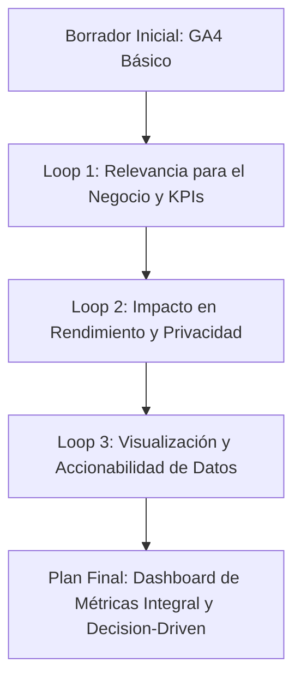
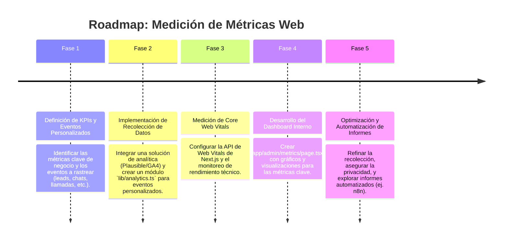

# 📊 Plan de Funcionalidades: Medición de Métricas Web de AgenciAlquimia

Este documento describe el plan para definir e implementar las funcionalidades de medición y monitoreo de métricas clave para la web de AgenciAlquimia. El objetivo es obtener una visión clara del rendimiento técnico, la experiencia del usuario, la efectividad del funnel de conversión y el impacto de las automatizaciones de IA.

---

## 1. 🎯 Objetivo Estratégico

Establecer un sistema de medición integral que permita a Matías:

*   **Monitorear el rendimiento técnico:** Asegurar que la web es rápida y fiable.
*   **Optimizar la experiencia de usuario (UX):** Identificar puntos de fricción y mejorar la navegación.
*   **Evaluar la efectividad del funnel:** Medir la conversión de visitantes a leads y a clientes.
*   **Cuantificar el impacto del Agente IA:** Medir la interacción y la eficiencia de los procesos automatizados.
*   **Tomar decisiones basadas en datos:** Utilizar insights para priorizar mejoras y estrategias.

---

## 2. 🧙‍♂️ Análisis de la Propuesta mediante el Método de los 3 Expertos

### 📈 Experto 1: Analista de Negocio & Especialista en Crecimiento
*   **Análisis:** Las métricas deben estar directamente ligadas a los KPIs (Key Performance Indicators) del negocio: generación de leads, cualificación, conversión. Es crucial diferenciar métricas de vanidad de aquellas que impulsan el crecimiento. El seguimiento del comportamiento del usuario en el chat y las llamadas a la acción es vital.
*   **Decisión:** Priorizar métricas de conversión (tasas de clic en CTA, envíos de formulario, inicios de chat, llamadas agendadas). Segmentar el tráfico (orgánico, pago, referido). Monitorear el `engagement` con el agente IA (número de interacciones, duración media del chat).

### ⚙️ Experto 2: Ingeniero Frontend & Especialista en WPO (Next.js/React)
*   **Análisis:** Next.js facilita la medición de Core Web Vitals y métricas de rendimiento del lado del cliente. La integración con herramientas de analítica debe ser asíncrona y no bloquear el renderizado. El seguimiento de eventos personalizados requiere una implementación limpia y modular.
*   **Decisión:** Utilizar la API de Web Vitals de Next.js para recolectar métricas de rendimiento. Integrar una librería de analítica ligera (ej. `Plausible Analytics` o `Google Analytics` si es requerido) de forma lazy-loaded. Implementar un módulo centralizado (`lib/analytics.ts`) para el envío de eventos personalizados.

### 🔐 Experto 3: Líder de Seguridad, Privacidad & DevOps
*   **Análisis:** La recolección de métricas debe respetar la privacidad del usuario (GDPR/LOPDGDD). Evitar la recolección de PII (Personally Identifiable Information) a menos que sea estrictamente necesario y con consentimiento explícito. El almacenamiento y procesamiento de métricas debe ser seguro y escalable.
*   **Decisión:** Anonimizar IP y datos de usuario siempre que sea posible. Optar por soluciones de analítica que permitan un mayor control de datos (ej. `self-hosted` si es viable). Configurar el `Content Security Policy (CSP)` si es necesario para las integraciones. Asegurar que la infraestructura de monitoreo no añada una carga excesiva al VPS.

---

## 3. 🔄 Self-Refinement Loop (3 Ciclos de Refinamiento Iterativo)

### 🔁 Ciclo 1: Relevancia para el Negocio y KPIs
*   **Planteamiento Inicial:** Medir métricas web estándar (visitas, rebote).
*   **Crítica de Refinamiento:** Las métricas estándar son un buen punto de partida, pero no siempre se traducen directamente en insights de negocio para una agencia de IA. Se necesita ir más allá para entender la conversión y el impacto del agente.
*   **Solución Refinada:** Definir un conjunto de **métricas personalizadas** centradas en el funnel: `lead_generated`, `chat_started`, `call_scheduled`, `audit_downloaded`. Monitorear la **tasa de conversión** en cada etapa. Segmentar el análisis por origen de tráfico y por campaña.

### 🔁 Ciclo 2: Impacto en Rendimiento y Privacidad
*   **Planteamiento Inicial:** Integrar Google Analytics de forma predeterminada.
*   **Crítica de Refinamiento:** Google Analytics (GA4) es potente pero puede ser intrusivo y afectar ligeramente el rendimiento si no se gestiona con cuidado. La privacidad es una preocupación clave para los clientes de la UE.
*   **Solución Refinada:** Explorar alternativas `privacy-friendly` y `lightweight` (ej. `Plausible Analytics` o `Fathom Analytics`). Si se usa GA4, implementar consentimiento (`cookie banner`), anonimización de IP y carga `lazy` (`next/script`). Considerar un **dashboard interno** simple en el panel admin que agregue datos de Supabase/n8n sin depender de terceros (ej. leads, interacciones de chat).

### 3. 🔁 Ciclo 3: Visualización y Accionabilidad de Datos
*   **Planteamiento Inicial:** Simplemente recolectar los datos.
*   **Crítica de Refinamiento:** Datos sin una visualización clara y sin contexto son difíciles de usar. El objetivo es tomar decisiones rápidas.
*   **Solución Refinada:** Crear un **Dashboard de Métricas** en el propio panel administrativo (`/admin/metrics` o `/admin/dashboard`) utilizando librerías de gráficos ligeras (ej. `recharts`, `react-chartjs-2`). Visualizar tendencias, tasas de conversión, rendimiento de Core Web Vitals y actividad del agente IA. Proporcionar **alertas configurables** para caídas de rendimiento o conversión.

---

## 4. 🗺️ Roadmap de Implementación por Fases

---

**Fecha de Creación:** 2026-08-22
**Autor:** Mercurio (Agente IA de OpenClaw)
